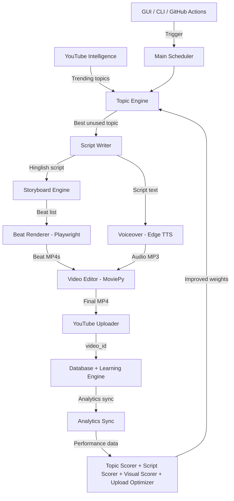

# 🎬 YoutubeAutomator

**YoutubeAutomator** is a fully autonomous Python bot that generates and uploads YouTube Shorts on autopilot. It handles the entire pipeline — from trend-based topic discovery and AI-scripted Hinglish narration, to animated beat rendering via Playwright, voiceover synthesis with Edge TTS, video compilation with MoviePy, and direct upload to YouTube via the Data API. The system learns from its own analytics to improve future content.

The bot is designed for the Indian coding/DSA education niche (think CodeWithHarry-style Shorts) but can be adapted to any niche by editing YAML config files in `niches/`. It runs locally with a CustomTkinter GUI or headlessly in the cloud via GitHub Actions — no human intervention required after initial setup.

---

## 📐 Architecture



---

## 🚀 Setup Instructions

### Prerequisites

- **Python 3.11+**
- **FFmpeg** — `brew install ffmpeg` (macOS) or `sudo apt install ffmpeg` (Ubuntu)
- **Google Cloud Project** with YouTube Data API v3 and YouTube Analytics API enabled
- **Groq API Key** (free) from [console.groq.com/keys](https://console.groq.com/keys)
- **Pexels API Key** (free) from [pexels.com/api](https://www.pexels.com/api/)

### 1. Clone & Set Up

```bash
git clone https://github.com/YOUR_USERNAME/YoutubeAutomator.git
cd YoutubeAutomator
python3 -m venv venv
source venv/bin/activate
pip install -r requirements.txt
playwright install chromium
```

### 2. Configure Credentials

```bash
# Copy the template and fill in your keys
cp .env.example .env
nano .env   # Add your GROQ_API_KEY, PEXELS_API_KEY, etc.
```

**YouTube OAuth Setup:**
1. Go to [Google Cloud Console](https://console.cloud.google.com/)
2. Create a project → Enable **YouTube Data API v3** and **YouTube Analytics API**
3. Create OAuth 2.0 credentials (Desktop App type)
4. Download as `client_secrets.json` and place in the project root
5. On first run, a browser window opens for Google sign-in → creates `token.json`

### 3. First Run

```bash
# Generate a single video (opens browser for YouTube auth on first run)
python3 main.py --now

# Or generate a specific topic
python3 main.py --topic "Binary Search ka asli secret"
```

---

## 🖥️ CLI Command Reference

| Command | Description |
|---------|-------------|
| `python3 main.py` | Start the scheduler (runs batch every 8 hours + analytics every 6 hours) |
| `python3 main.py --now` | Run one full batch cycle immediately |
| `python3 main.py --topic "My Topic"` | Generate a video for a specific topic |
| `python3 main.py --topic "My Topic" coding.yaml` | Specify topic + niche config |
| `python3 main.py --batch coding.yaml 5` | Batch generate 5 videos for a niche |
| `python3 main.py --intelligence` | Run the Intelligence Engine (scrape trending topics) |
| `python3 analytics_sync.py --run-once` | Run a one-shot analytics sync + learning update |

### Environment Variables

| Variable | Default | Description |
|----------|---------|-------------|
| `HEADLESS_MODE` | `false` | Set to `true` for GitHub Actions / cloud mode (skips GUI, venv auto-activate) |
| `DAILY_VIDEO_LIMIT` | `6` | Max videos per day to preserve API quotas |
| `LLM_PROVIDER` | `groq` | LLM backend: `groq`, `gemini`, or `openai` |
| `VIDEO_FORMAT` | `shorts` | `shorts` (<60s vertical) or `long` (horizontal) |

---

## ☁️ GitHub Actions Deployment (Headless Cloud Mode)

Run the bot 24/7 on GitHub without a local machine. GitHub Actions replaces the local scheduler.

### How It Works

Three workflow files in `.github/workflows/` handle automation:

| Workflow | Schedule | What It Does |
|----------|----------|-------------|
| `batch_run.yml` | Every 8 hours (2am, 10am, 6pm UTC) | Full video generation pipeline |
| `analytics_sync.yml` | Every 6 hours (offset from batch) | Sync YouTube analytics + update learning weights |
| `intelligence_refresh.yml` | Weekly (Sunday midnight UTC) | Scrape trending topics for the topic engine |

### Setup Steps

1. **Push the repo to GitHub** (ensure `.gitignore` is committed first!)

2. **Add secrets** in GitHub → Settings → Secrets → Actions:

   | Secret Name | What to Store |
   |-------------|--------------|
   | `ENV_FILE` | `base64 -i .env` output |
   | `GOOGLE_CLIENT_SECRETS` | `base64 -i client_secrets.json` output |
   | `GOOGLE_OAUTH_TOKEN` | `base64 -i token.json` output |

   Generate base64 values:
   ```bash
   base64 -i .env | pbcopy              # macOS: copies to clipboard
   base64 -i client_secrets.json | pbcopy
   base64 -i token.json | pbcopy
   ```

3. **Enable workflows** — Go to the Actions tab and enable the workflows.

4. **Test manually** — Click "Run workflow" on `batch_run.yml` to verify.

### Database Persistence

The `automation.db` SQLite database is persisted between runs using GitHub Actions Cache. This preserves all learning data, topic history, and analytics across workflow runs.

### Token Refresh

The OAuth `token.json` includes a `refresh_token`. The bot automatically refreshes expired access tokens without a browser — critical for headless operation. Tokens are saved back after refresh.

### Budget

- Public repos: 2,000 free minutes/month → 3 batch runs/day × 20 min ≈ 1,800 min/month ✅
- Private repos: 500 free minutes/month → would exceed by day 9 ⚠️

---

## 📁 Project Structure

```
YoutubeAutomator/
├── main.py                  # Entry point — scheduler, CLI, headless mode
├── topic_engine.py          # Topic discovery + Intelligence Engine
├── script_writer.py         # AI script generation (Hinglish)
├── storyboard_engine.py     # Converts script → animated beat storyboard
├── beat_renderer.py         # Playwright HTML/CSS → MP4 beat rendering
├── voiceover.py             # Edge TTS voice synthesis
├── video_editor.py          # MoviePy video compilation + Pexels backgrounds
├── youtube_uploader.py      # YouTube Data API upload + OAuth
├── analytics_sync.py        # YouTube Analytics pull + learning sync
├── learning_engine.py       # Best upload time slot predictor
├── topic_scorer.py          # Topic performance scoring
├── script_scorer.py         # Script pattern learning
├── visual_scorer.py         # Beat visual performance tracking
├── upload_optimizer.py      # Upload timing + thumbnail optimization
├── database.py              # SQLite schema + core DB operations
├── db_migration.py          # Schema migrations
├── render_worker.py         # Parallel render job dispatcher
├── upload_renders.py        # Bulk upload pending renders
├── utils.py                 # Cleanup + file organization helpers
├── text_preprocessor.py     # Hinglish text processing
├── youtube_intelligence.py  # YouTube trend analysis
├── quota_manager.py         # API quota tracking
├── gui.py                   # CustomTkinter GUI (local mode only)
├── niches/                  # Niche config YAML files
│   └── coding.yaml
├── .github/workflows/       # GitHub Actions automation
│   ├── batch_run.yml
│   ├── analytics_sync.yml
│   └── intelligence_refresh.yml
├── requirements.txt
├── .env.example
└── .gitignore
```

---

## 📄 License

This project is for personal/educational use.
